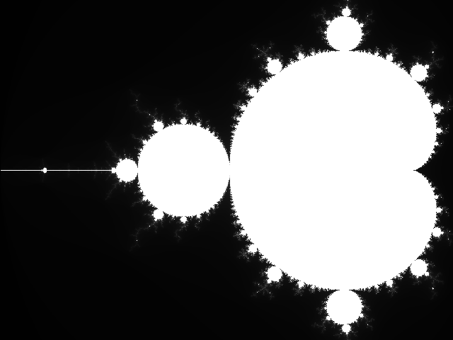

# Week 7
Initial note: Due to some design choices I've made my language now deviate from the course version of the language.
Therefore I was unable to do some / most of the associated exercises for this week. Instead I'll explain my current
implementation and reference exercies when appropriate.


## Status of language implementation


### Closures
One of the design goals of my language was to implement closures / functions as first class objects. I.e one should be
able to create and pass around functions anywhere. To this end I stared by extending the _expression_ part of the
grammar with two new constructs `lambda` and `call`:

```lua

local grammar = lpeg.P{
    "program",
    program     = space * sequence,
    primary     = ((lhs + T"(" * expression * T")") * args) / node("call", "lambdaexpr", "params")
                + (R"lambda" * params * block) / node("lambda", "params", "block")
    -- snip --

    params      = T"(" * T")" / node("params", "_")
                + (T"(" * identifier * (T"," * identifier)^0 * T")") / node("params"), 
    args        = T"(" * T")" / node("params", "_")
                + (T"(" * expression * (T"," * expression)^0 * T")") / node("params"), 
    -- snip --
}
grammar = grammar * -1

```

The idea here is that the `lambda` operator will create an new object - a callable _closure_ - containing executable
code as well as storage for a local frame / environment  consisting of local variables, function parameters (pushed via
the stack) and copies (by value) of any variable outside the scope of the function.

The (frame-) data and code is constructed by recursively calling the `Compiler:genProgramImage` method on the
lambda-body. Then code is generated to copy free-variables external to the closure into its frame-data.

The lambda expression then leaves the closure on the stack and it can be bound to any variable. The closure is generated
with the new virtual machine instruction `CLOSURE`.


The `call` construct generates code to push function paramters onto the stack as well as the referenced closure (by
evaluating an expression). This triggers a virtual machine instruction `CALL` that hands over control to the closure
code and sets up a new environment. 

*Note:* I now have to stacks in the VM. One for passing data and one for saving the context of the current running
closure. The `RETURN` function now restores the previous frame.


```lua
    -- snip --
    elseif op_variant == Machine.OPCODES.CALL then
        local tos_0 = self.stack_:pop() -- the closure.
        local tos_1 = self.stack_:pop() -- the arity.
        assert(type(tos_0) == "table" and tos_0.tag == "closure", make_error(ERROR_CODES.TYPE_MISMATCH, {message = "Expected closure"}))
        assert(tos_0.arity == tos_1, make_error(ERROR_CODES.CLOSURE_ARITY, {message = "Expected " .. tos_1 .. " parameters."}))
        -- save current context
        self.call_:push({code = self.code_, data = utils.shallow_copy(self.data_), pc = self.pc_ + 1})
        
        self.code_ = tos_0.code
        self.data_ = tos_0.data
        self.pc_   = 1


    elseif op_variant == Machine.OPCODES.RETURN then
        -- restore previous context
        local call_info = self.call_:pop()
        self.code_ = call_info.code
        self.data_ = call_info.data
        self.pc_   = call_info.pc
```


### On Exercise 3: Recursion
With the approach described in the lectures recrusion or indirect recursion would be hard since the names of the
functions that are recursively called are not know to the compiler during code generation. This would lead to failures
during code generation.

Using the `lambda` construct above it is actaully possible to construct recursive closure invocations. It all hinges on the fact 
that we alreadyimplicitly implemented references (via arrays) to objects. Let me provide an example:

```
fac_ = {0} -- create an array of 1 element.
fac_[1] = lambda (n)
{
    if (n < 0)
    {
        return 1;
    }
    else
    {
        return fac_[1](n - 1) * n;
    }
};
fac = fac_[0];

@ fac(5); -- prints 120

```

This technique even extends to indirect recursion, however it's rather ugly. Which leads me into the next topic.

### Syntactic sugar for 'functions'.
To make creation of *functions* (e.g callable closures with some addional setup) and mutually recursive functions nicer
I decided to add some syntactic sugar that essentially mimics the snippet above. The key insight here was that _after_
the compile pass I could transform the AST (i.e adding and substituting expressions) in such a way that the additions
could never clash with user input. For example instead of adding a `_` as above I could introduce variables such as
`.fac` that users (by the syntax of the language) cannot create. 


To the grammar I added:

```lua
    -- snip --
    + (((R("function") * identifier * params * block) / node("function_", "identifier", "params", "block"))
    *  ((R("and") * identifier * params * block)^0 / node("function_", "identifier", "params", "block"))) / node("functions_")
    -- snip --
```

For example the code:

```
function odd(n)
{
    if (n < 0)
    {
        return odd(-n);
    }
    elseif (n == 0)
    {
        return 0;
    }
    else
    {
        return even(n - 1);
    }
}
and even(n)
{
    if (n < 0)
    {
        return even(-n);
    }
    elseif (n == 0)
    {
        return 1;
    }
    else
    {
        return odd(n - 1);
    }
}

```

will 

1. generate expression for ref-arrays equivalent to `.odd = {0}` and `.even = {0}`,
2. replace references to `odd` with `.odd[1]` and `even` with `.even[1]` in the function body (up to shadowing).
3. Create variables `odd = .odd[1]`, and `even = .even[1]` 

*Note:* The `function <id> <body> and <id> <body> and ...` was inspired by `Ocaml`:s recursive function syntax.

*Note:* This construct effectively solved the problem of forward delclarations (exercise 9).

### On Exercise 5: Name conflicts among functions
Since our current implementation considers closures and functions just another value we can overwrite a function by
defining it again (the same goes for closures). This is feature I want to keep so I don't add any extra logic to check
for function names. 

If one really wanted this behaviour it could be achieved by keeping track of the function names in the compiler. And
checking that there is no clash in the current frame. 


### Function calls as statements
Just as in the lecture-language I've implemented function calls as statements.

Grammar additions:

```lua
-- snip --
statements = --snip --
           + (variable * args) / node("call_as_statement", "lambdaexpr", "params")
-- snip --
```

The idea follows the logic in the lecture. A function is called and the result is poped from the stack.


### Additional improvements
1. A null type has been added to the language. The implementation still does not fill non-assigned variables with `null`
   but that will come in future updates.
2. I replaced the `for x in array` construct with a `for x in iterator` construct. A 0-arity function (or thunk) can be
   used to iterate over values until it return `null` when iteration stops (see `lesson-7/fractal.xpl` for usages).
3. I added statements `write(<file>, <expression>)` and `read(<file>, <expression>)` as well as "constant" expressions `stdin`, `stdout`
   `stderr` so I can more effectively communicate with the user.

## A larger example
To explore some of the new concepts I created a program that generates a (binary) `pbm` (or specifically a grayscale `pgm`) to
stdout. It can be executed using this command line:

```
LUA_PATH="lesson-7/?.lua;;" lua lesson-7/interpreter.lua  --load lesson-7/fractal.xpl > test.pgm
```

The execution is quite slow and could be improved significatnly by using simpler loop constructs and pre-compute more
values. But I wanted to use all new shiny features of the language.

Running the command above yields the following `pgm`:



The code listing:

```
function range(start, stop, step)
{
    current = start;
    return lambda ()
    {
        should_stop = 0;
        if (start >= stop and step < 0)
        {
            should_stop = current < stop;
        }
        else
        {
            should_stop = current > stop;
        }

        if (should_stop)
        {
            return null;
        }
        else
        {
            temp = current;
            current = current + step;
            return temp;
        }
    };
}

function decimal_width(n)
{
    if (n == 0)
    {
        return 1;
    }

    counter = 0;
    while (n > 0)
    {
        n = (n - (n % 10)) / 10;
        counter = counter + 1;
    }

    return counter;
}

digits = {
    0x30, 0x31, 0x32, 0x33, 0x34,
    0x35, 0x36, 0x37, 0x38, 0x39
};

function digit_to_ascii(d)
{
    return digits[d + 1];
}

function integer_to_ascii(x)
{
    width = decimal_width(x);
    str   = new[width];
    for i in range(width, 1, -1)
    {
        rem = x % 10;
        str[i] = digit_to_ascii(rem);
        x = (x - rem) / 10;    
    }
    return str;
}


function write_pbm(img)
{
    height  = len(img);
    width   = len(img[1]);

    # write header
    # P5\n
    write(stdout, {0x50, 0x35, 0x0a});
    # <width><space>
    write(stdout, integer_to_ascii(width));
    write(stdout, 0x20);
    # <height>\n
    write(stdout, integer_to_ascii(height));
    write(stdout, 0x0a);
    # <maxval>\n
    write(stdout, integer_to_ascii(255));
    write(stdout, 0x0a);

    for row in range(1, height, 1)
    {
        write(stdout, img[row]);
    }
}

function norm2(z)
{
    return z[1]*z[1] + z[2]*z[2];
}

function mandelbrot_score(c)
{
    max_iterations = 255;
    iteration = 0;
    z = {0.0, 0.0};
    while (iteration < max_iterations and norm2(z) < 4)
    {
        re_temp = z[1] * z[1] - z[2] * z[2] + c[1];
        z[2] = 2 * z[1] * z[2] + c[2];
        z[1] = re_temp;
        iteration = iteration + 1;
    }

    return iteration;
}


function mandelbrot()
{
    height = 480;
    width  = 640;
    
    re_range = {-2.00, 0.47};
    im_range = {-0.92625, 0.92625};

    img = new[height][width];
    
    for row in range(1, height, 1)
    {
        write(stderr, integer_to_ascii(row));
        write(stderr, 0x0d);
        for col in range(1, width, 1)
        {
            re = re_range[1] + (re_range[2] - re_range[1]) * ((col - 1) / width);
            im = im_range[1] + (im_range[2] - im_range[1]) * ((row - 1) / height);
            img[row][col] = mandelbrot_score({re, im});
        }
    }

    return img;
}

function main()
{
    img = mandelbrot();
    write_pbm(img);
}


main()
```
