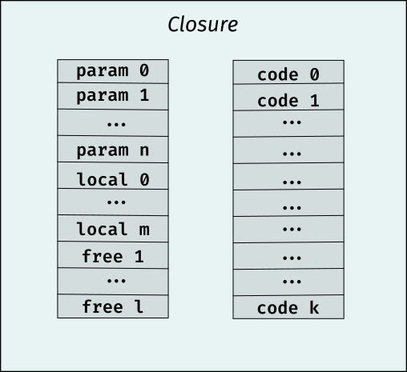

# Final Project Report: eXperimental Programming Language (XPL)

<p align="center">
    
</p>

The name for XPL is inspired by the _X-plane_ series of experimental aircrafts. Just as its aerodynamical "brothers"
it's not a finished product nor intended for production use[^1]. XPL is, simply, a tool for exploring programming
language design and implementation. 

XPL is implemented using [Lua](https://www.lua.org) and [LPeg](https://www.inf.puc-rio.br/~roberto/lpeg/) and inspired
by the _Selene_[^2] language. The design goal was an imperative, dynamically typed language with closures as first class
citizens and I believe we reached that goal.

The official logo for XPL is a rendition of the [Mandelbrot set](https://en.wikipedia.org/wiki/Mandelbrot_set) in a
rectangular area of the complex plane given by the two points $z_0 = -0.1475 - 0.92625i$ and $z_1 = 0.47 - 0.463125i$.
This was the first useful program implemented in XPL so it seemed appropriate. 

## Using the language
The basic requirements for running the interpreter is an installation of Lua (>= 5.3) and LPeg. To run the tests suite
you'll also need [luaunit](https://github.com/bluebird75/luaunit) installed[^3]. 

To run a XPL-script you navigate to the root of this repository and then execute the following command:

```bash
./run [--trace] [--load_path <path/to/xpl/libdir> ...] --load <path/to/xpl/script>

```

For example to run the `report/mandelbrot.xpl` script you would write
```bash
./run --load_path "report" --load report/examples/mandelbrot.xpl > mandelbrot.ppm
```

#### Running tests
There are several tests defined in `report/project_tests.lua` you can run them using the following script.

```
./run-tests
```

### Load Paths
The `--load_path` argument specifys the path to search locations for XPL modules / libraries. XPL scripts might source
other XPL scripts and it needs to know where to find them. It will search the (possibly multiple) _load paths_ provided
by the `--load_path` argument when sourcing dependent scripts (see the section on Modules below).

### Traces
The `--trace` argument will show a _disassembly_ of the VM-instructions as it runs through the program. This is useful
for debug purposes but is very slow and interfers with output. Use with care.


## Language Syntax
The basic language syntax follows that of the Selene language but several additions have been made, especially when it
comes to control structures and functions / lambda expressions. The examples of the grammar are given in _pseudo EBNF_
together with examples.

### Identifiers
An identifier in XPL starts with a `letter` (`"A" | "B" ... "Z" | "a" ... "z"`) followed one ore more `letter`, `digit`
(`"1" | "2" ... "9"`) or `"_"` symbols. 

```
identifer = letter , { letter | digit | "_" }
```

Examples of valid identifiers are 
- `a`, 
- `alpha`,
- `alpha3342`,
- `Beta_` 
- `Theta_2032_3`. 

Examples of invalid identifiers are 
- `.x124`, 
- `434dfx`,
- `ab ba`. 

#### Note 
Some identifers are reserved for language constructs and can not be used in for example variable or function names.
Please refer to `report/compiler.lua` for reserved words.

### Literals

#### Numerals
XPL supports numerals in either decimal or scientific notations in base 10. Integers can also be given using hexadecimal
notation. A numeral can be prefixed with either a `+` or `-` symbol[^4].

```
sign     = "+" | "-"
digit    = "0" | "1" | ... | "9"
posint   = digit , {digit}
integer  = [sign] , posint
hexdigit = digit | "a" | "b" | ... | "f" | "A" | ... | "F"
hexint   = [sign] , "0" , ("x" | "X") , hexdigit , {hexdigit} 
decimal  = integer , ["."] , [posint] | [sign] , "." , posint
numeral  = hexint | decimal | decimal , ("e" | "E") , integer
```

Examples of valid numeral literals are
- `1`
- `202423`
- `0xdeadc0de`
- `123.3432`
- `123.2e10`
- `-123.2E10`
- `+0x43f`

Examples of invalid numeral literals are
- `0x534.5`
- `1.24e343.4`
- `232.232.232`


#### Array
XPL supports array literals using the _array constructor_ syntax:

```
array = "{", {expression}, "}"
```

A array literal starts with a curly brace, then an optional sequence of expressions follow and the literal ends with a
closing curly brace.

Examples of arrays are:
- `{1, 2, 3}`
- `{(1 + 1), {3, "hello"}, lambda () { return 10; }}`
- `{}`


#### Hashmaps
XPL support hashmap literals using a similar constructor expression as arrays. It uses the following syntax:

```
keyval  = expression , ":" , expression
hashmap = "[" , {keyval} , "]"
```

That is a hashmap starts with a opening bracket, then an optional sequence of key value expressions follow (i.e pair of
expressions seperated by a ":" character) and then it ends with a closing bracket.

Examples of hashmaps:
- `[1: "Peter", 2: "Sven"]`
- `["Alpha": "a", "Beta": "b"]`
- `[(16 * 7): lambda (x, y) { return x + y; }]`

#### Strings
XPL supports double quoted strings with escape sequences. A string starts with a double quote and ends with a _non_
escaped double quote. Any byte sequence can be inserted by the means of the escape sequence `"\", "x" , hexdigit , hexdigit` 
(e.g `\x0a` for a linefeed symbol).

```
hexescape  = "\" , "x" , hexdigit , hexdigit
lfescape   = "\" , "n"
crescape   = "\" , "r"
tabescape  = "\" , "t"
quotescape = "\" , """
backescape = "\" , "\"
char       = <printable character>
string     = """ , {hexescape | lfescape | crescape | tabescape | quotescape | backescape | char} , """
```

Example of valid strings are
- `"This's an example of a valid string."`
- `" Hello\n\tBrave\x0aNew World!!!"`
- `"\"Quoted string\""`

Example of invalid strings are
- `"does not end with a double quote`
- `'single quotes are not strings'`
- `does not start with a double quote"`
- `"forgot to escape "in this string"`

##### String implementation
String are implemented as XPL-arrays with integer values. This is a bit wasteful and complicates, for instance, string
comparision (we actually have to compare strings element by element). Otoh I can use the same code-generation facilities
that I use for array-literals, which makes it very easy to implement.

#### Null
A abscense of value literal is provided via null-expression:

```
null = "null"
```

### Variables
Variables in XPL are symbolic names for values (closures, arrays, hashmaps, strings, files, null and numbers). A variable is
named by an _identifier_ (excluding reserved words) and must be declared before first use, using a variable
_declaration_ statement:

```
declaration = "variable" , identifier [= , expression]

```
Examples of valid variable declarations are:

```
variable my_var; # declares my_var and initiates it to "null"
variable my_other_var = 234 * 25; # variable with initialization.

```

Once a variable has been declared it can be used in any expression:

```
variable v = 1.54;
variable m = 99.0;
variable W = m * v^2 / 2;
```

Since XPL is dynamically typed it's up to the user to guarantee that the expressions involving variables (or any other
values) make sense. Trying to multiply a closure with a number will lead to a runtime error!

#### Assignment
A variable is updated via an _assignment_ statement. For a assignment to be valid the variable first has to be declared
(semantic check in compiler). The assigment statement takes the following form:

```
lhs        = identifier , "[" , expression , "]" , {"[" , expression , "]"} 
           | identifier , "." , expression , {"." , expression}
           | identifier
assignment = lhs , "=" , expression
```

Note that this grammar also includes array / hashmap assignment through indices. 


#### Variables and scope
It is an error to declare the same variable more than once in the same _scope_ (e.g the same block or closure). However
you can declare a variable with the same name in a different block or closure. Examples

Invalid re-declaration.
```
variable x;
variable x = 10; # Error! 

```

Valid re-declarations.
```
variable x = 10;
{
    # A block introduces a new scope.
    variable x = 20; # Here 'x' refers to a differnt storage cell.

}

function its_ok_to_use_x(y)
{
    variable x = y;
    # ...
}

```

A variable is _always_ local to it's current closure. There are no globally mutable variables in XPL. Closures will
copy _free variables_ by value.

### Expressions
An expression is anything that can be on the rhs of an assignment or operated on by a select set of _statments_ (e.g return,
print (`@`), read, write, etc...). It includes literals, arithmetical operations on expressions, logical operartions,
file constants, null, array / hashmap indexing, lambda expressions, function calls and module inclusion.

```
primary    = (lhs | "(" , expression , ")") , args
           | "lambda" , optparams , block
           | "new" "[" , expression , "]" , {"[" , expression , "]"}
           | array
           | hashmap
           | numeral
           | "null"
           | "len" , expression
           | "(" , expression , ")"
           | ("stdin" | "stdout" | "stderr")
           | string
           | lhs
           | "require" , string

exponent   = primary , "^" , primary

negation   = {("-" | "!") , exponent

term       = negation , {("*" | "/" | "%") , negation}

addend     = term , {("+" | "-") , term}

comparison = addend , {("<" | ">" | "<=" | ">=" | "==" | "!=") , addend}

logical    = comparison { "and" , comparison }

expression = logical { "or" , logical }

```

An expression is not a valid XPL-program on it's own. It needs to be associated to a statement. From an implementation
perspective one can think of expressions as something that pushes a new value onto the stack of the VM.[^5]

#### Operators
XPL suppor the following operators

| Operator | Precendence | Arity | Comment                    |
|----------|--------------|-------|-----------------------------|
|    ^     |      1      |   1   | exponent, right associative|
|    -     |      2      |   1   | additive negation          |
|    !     |      2      |   1   | logical negation           |
|    *     |      3      |   2   | multiplication             |
|    /     |      3      |   2   | division                   |
|    %     |      3      |   2   | modulus                    |
|    +     |      4      |   2   | addition                   |
|    -     |      4      |   2   | subtraction                |
|    >     |      5      |   2   | greater then               |
|    >=    |      5      |   2   | greater or equal to        |
|    <     |      5      |   2   | less then                  |
|    >=    |      5      |   2   | less or equal to           |
|    ==    |      5      |   2   | equal to                   |
|    !=    |      5      |   2   | not equal to               |
|    and   |      6      |   2   | logical and                |
|    or    |      7      |   2   | logical or                 |


### Statements, Sequences and Blocks
A valid XPL program consists of _sequences_ of _statements_. A statement is either a _block_ (encompassing
control structures) or a set of special statements (assignment, return, break etc...):


```
program   = space * sequence

sequence  = block , [sequence]
          | statement , [";" , sequence]

block     = ifstmt
          | switchstmt
          | for1stmt
          | for2stmt
          | whilestmt
          | functionstmt
          | "{" , sequence , "}"

statement = block
          | "return" , expression
          | "break"
          | identifier , args
          | ":" , expression
          | "@" , expression
          | "read" , "(" , expression , "," , expression , ")"
          | "write" , "(" , expression , "," , expression , ")"
          | declaration
          | assignment
```

The control structures will be convered in other sections.

### Arrays and Hashmaps
XPL has support for arrays and hasmaps / tables[^6]. You can create them using the array or hashmap literal as described
in the "literals" section. You can also create arrays using the `new` keyword (see expressions):

```
"new" "[" , expression , "]" , {"[" , expression , "]"}
```

Examples of array and hashtable creation:

```
variable a = new [100][100]; # an array consisting of 100 elements, each being an array of 100 elements.
variable b = {1, 2, 3};      # an array containing the value 1, 2, 3.
variable h = [];             # an empty table.
variable i = ["test": 1, 
              "test2": 2]    # an table with string keys "test" and "test2" and values 1, 2 respectively.

```

To access into an array or table you can use the index operator `[]`:

```
indexop = identifier , "[" , expression , "]" , {"[" , expression , "]"} 
```

For tables (with string keys) you can also use the `.` operator:

```
dotop  = identifier , "." , expression , {"." , expression}

```
### Lambda expressions and Functions
A lambda expression creates a callable closure. A closure consists of an _environment_ with _parameters_, _local_ and
_free_ variables. Upon creation of a closure all _free_ variables are copied into the closure environment. When calling
a closure the formal _parameters_ are copied into the closure environment from the stack. 

A lambda expression has the following syntax:

```
idassign  = identifier , ["=", expression]
optparams = "(" , space , ")" | "(", idassign , {"," , idassign} , ")"
lambda = "lambda" , optparams , block
```

Examples of lambda expressions are:
```
variable a = lambda () { variable c = 0; return c; };
variable b = lambda (x, y, z) { return x + y + a(); };
```

Lambda expression have a central role in XPL and many other language constructs builds on these, most importantly
functions, but also modules and iterators. 

Function statements are syntactic sugar around lambda expressions (we will go into implementation details in another
section) and variables. It has the following syntax:

```
functions = "function" , identifier , optparams , block {, "and" , identifier , optparams , block}
```

Mutually recursive functions are defined in one statement as in the following example:

```
variable false = 0;
variable true  = 1;
function odd (n)
{
    if (n < 0)
    {
        return odd(-n);
    }
    elseif (n == 0)
    {
        return false;
    }
    else
    {
        return even(n - 1);
    }
}
and even(n)
{
    if (n < 0)
    {
        return even(-n);
    }
    elseif (n == 0)
    {
        return true;
    }
    else
    {
        return odd(n - 1);
    }

}
```

This syntax is inspired by OCamls `let rec fun1 = ... and fun 2 = ...` syntax[^7]. Here is another example of a function
statement show how closures captures freevariables of the surrouding environment:
```
function iterator (start, stop, step = 1)
{
    variable current = start;
    variable should_stop = lambda (current)
    {
        if (start > stop and current < stop)
        {
            return 1;
        }
        elseif (start <= stop and current > stop)
        {
            return 1;
        }
        else
        {
            return 0;
        }
    };
    return lambda ()
    {
        if (should_stop(current))
        {
            return null;
        }
        else
        {
            variable temp = current;
            current = current + step;
            return temp;
        }
    }
}
```
#### Calls
A function / lambda expression / closure can be called using the following syntax:

```
args = "(" , space , ")" | "(" , expression , {"," , expression} , ")"
call = (lhs | "(" , expression , ")") , args
```

Examples
```
variable it = iterator(1, 20, 2);

@ (lambda () { return {1, 2, 3}; })();

```

Argument expressions are evaluated in order and pushed onto the stack. The closure then copies the params into the data
section reserved for the formal parameters.

### Control Structures

#### If-statement
The grammar for if statment is as follows:

```
ifstmt = "if" , expression , block , [ifrest | "else" , block]
ifrest = "elseif" , expression , block , [ifrest | 'else' , block]
```

Valid if statments:
```
variable x = 20;
## without else
if x > 15
{
    @ x;
}

## with else
if (x > 15)
{
    @ x;
}
else
{
    @ 0;
}

## with elseif
if (x > 15)
{
    @ x;
}
elseif (x > 10)
{
    @ x - 10;
}
elseif (x > 5)
{
    @ -x;
}
else
{
    # do nothing
}

```

Note that a `else` must always come last and `elseif` cannot start a if-statement.
#### Break-statement
A break statement is used for escaping loops or switch-cases early. 

```
break = "break"
```

The break statement is scoped so that if there are nested loop or switch statements the innermost `break` will only
escape the innermost loop or switch. 

#### Return-statement
A return statement returns control to the calling closure. In case of the TOP-closure execution in the VM is halted. A
return statement can take an optional argument that will be pushed onto the stack. If no argument is provided `null` is
push to the stack.

Syntax:

```
return = "return" , [expression]
```


#### Switch-statement
The syntax for the switch-statement closely follows that of C. The XPL grammar for switch statements is
```
switch = "switch" , expression , "{" , {"case" , expression , ":" , block } , ["default" , ":" , block] , "}"
```

If a case-block does not contain a `break` or `return` statement we will fall-through to the next case.

Examples of switch-cases:

```
variable x = 10;
switch (x)
{
    case 1:
    {
        write(stdout, "Case one\n");
        break;
    }
    case 10:
    {
        write(stdout, "Case ten, will fall through!\n");
    }
    case 11:
    {
        write(stdout, "Case eleven\n");
        break;
    }
    default:
    {
        write(stdout, "The default case\n");
    }
}
```
#### For statement
There are 2 different kind of _for_-loops in XPL. One is the _C-styled_ for
```
for1stmt = "for" , [identifier , "=" , expression ] , ";"
                 , [expression] , ";"
                 , [assignment] , ";"
                 , block
```

and the other is the _iterator_ for

```
for2stmt = "for" , identifier , "in" , expression , block
```

In the _iterator_ for-loop the `expression` should return a _thunk_[^8] that returns `null` when iteration is complete. 


Examples of for-statements:

```
# x local to for-loop block
for x = 10; x < 20; x = x + 3
{
    @ x;
}

# x outside for-loop block
variable x = 10;
for ; x < 20; x = x + 3
{
    @ x; 
}

for x in iterator(0, 100, 25)
{
    @ x;
}

```

#### While-statement
While statements has the following syntax:

```
whilestmt = "while" , expression , block
```

Example:

```
variable x = 10;
while (x < 100)
{
    @ x;
    if ( x < -3)
    {
        break; # break out of loop early.
    }

    x = x - 1;
}

```

### Modules
A module is a closure defined in another file. A module can be loaded and executed by the _require_ expression:

```
require = "require" , string
```

Modules are essentially handled as _thunk_ and executed as soon as they are loaded. Generally a module would return a
hashtable constisting of functions and values. 

The search paths for modules are passed to the compiler via the constructor. If no constructor is passed relative paths
are resolved relative to the CWD.

Example:
```
variable strings = require "std/strings.xpl"; 
```

This executes the closure defined in the script `std/strings.xpl` and puts the result in the variable _strings_. 

### Comments
There are two kinds of comments in the language: Line comments and Block comments. The grammar for comments is actually
baked into the grammar for white spaces (as in the case of Selene):

```
comment     = "#{" , block_rest | "#\n" | "#" * line_rest_0
block_rest  = "#}" | <any-character> , block_rest
line_rest_0 = (<any-character> - "{") , line_rest_1
line_rest_1 = (<any-character> - "\n") , line_rest_1 + "\n"
space       = {(" " | "\n" | "\t") + comment}
```

Example of comments:
```
## Line comment

variable y; # another line comment.

#{

#{
    # comment nested 
    This is still a comment 
#}

variable #{ in line comment #} x = 10;

```
### Other

#### IO
Very simple IO constructs are available for communicating with the outside world. The `stdout` , `stdin`, `stderr`
literals pushes a `file` object onto the stack.


The statments `write` and `read` operates on files. `write` writes out an object (usually string or array) onto it's
first (file) argument. `read` reads input into an array (`len(array)` bytes).


#### Length
The `len` operator returns the size of an array.


#### Print 
The print statement:

```
print = "@" , expression
```

Prints the contents to stdout. This is mostly used for debugging purposes.


#### Side effect
The side effect statement:
```
side_effect = ":" , expression
```

evaluates a expression just for it's side effects (value poped from the stack and discarded).


## New Features/Changes
_XPL_ although derived from _Selene_ departs slightly from it's syntax (e.g additional control strutures, lambda
expressions, break statements) and quite a lot implementation-wise. In this section I'll go through some of these
differences. 

### Lambda expressions and functions

#### More on closures
As stated earlier lambda expressions is the mechanism we use to create callable closures in _XPL_. A closure consist of
a _code_ segment and a _data_ segment (see illustration below). The _data_ segment hold all the values that the _code_
section refers to. Any code we compile will result in a closure. The first closure to be compiled is refered to as the
"top" closure. This is what will start executing when we pass it to the VM.

<p align="center">
    
</p>

When we _create_ a closure (during run-time) there are several things happening:

1. A (XPL) array is created large enough to hold all data in the closure data-segment.
2. All variables that are _free_ inside the closure are copied into the appropriate location in the array.
3. We replace the data array in the  closure primitive (essentially a closure data structure with code but an unfilled array) 
   that currenly resides on the top of the stack, by means of the `CLOSURE` instruction.

When we _call_ a closure the following happens:

1. The arguments associated to the formal parameters of the closure are push onto the stack.
2. We save the state of the current running closure by pushing it on a special _call_ stack (not the data stack). This
   state includes `data`, `code` segment as well as the `pc` and a few more meta-data.
3. Control is passed to the closure by setting the `data` and `code` pointers of the VM to the to-be-called closures segments, and
   setting the `pc` to `1` - the first instruction of the closure code-segment.

When we _return_ from a closure:

1. We copy-back the data segment to the current closure (it's held as a refernce in the VM).
2. We restore the calling closure by pop-ing the callstack and overwriting the `data` and `code` pointers in the VM to
   point to the caller. Then we restore the `pc` and continue execution.


*Note 1:* Keeping a separate stack for closure-calls simplified the implementation a lot. I don't need to construct
frames inside the data-stack.

*Note 2:* The copying closure parameters back and forth through calls gives us a overhead on the call function (compared
to the stack-frame call method). 


#### More on functions
Functions are just syntactic sugar wrapped around lambda closures, variables and arrays. With the introduction of arrays
we actually have a mechanism of referensing objects "outside" of the closure. Most importantly we can refer to the
closure itself by writing it into an array. 

Let me provide an example to illustrate this. Consider the following program
```
variable fac = lambda (n)
{
    if (n <= 0)
    {
        return 1;
    }
    else
    {
        return fac(n - 1) * n;
    }
}

```
This program will fail to compile, since `fac` is not know at the moment the lambda is being constructed. We cannot refer
to `fac` inside the closure. Even if we try to remedy this by first defining the variable `fac` as `null` and then
setting it to the lambda expression it will fail (with the current implementation of the compiler) since the _value_ of
the _free_ variable `fac` that will be copied into the closure is at the time of copying `null`!

However if we transform the above expression as such

```
variable fac_ = {0}; # create an array of 1 element.

fac_[1] = lambda (n)
{
    if (n <= 0)
    {
        return 1;
    }
    else
    {
        return fac_[1](n - 1) * n;
    }
};
fac = fac_[0];

@ fac(5); # prints 120

```
We actually have a working implementation of `fac`. How did this work? Well, at the time of creation we passed in `fac_`
to the closure (by value). `fac_` is an array - essentually a pointer - and when we then assign the closure to the first
element of this array we can actually reference the closure itself _inside_ the closure.

With this insight in-mind creating function statements is just a way of generating the appropritate arrays, variables
and closures. 

The code generation for the `function` statement does the following:

1. Creates a new AST node containing a variable declaration  with a unique non-parseable (i.e cannot clash with user names) 
   variable name to hold the 1-element array which will store the closure reference. E.g for a function called `fun` and
   array called `.fun` will be created.
2. Creates a new lambda-node which takes the function block as it's block, however all non-shadowed names `fun` are
   replaced with a node containing the equivalent to `.fun[1]`. (e.g `fun(n - 1) -> .fun[1](n - 1)`)
3. Creates a node with a variable declaration with the function name (e.g `fun`). 
4. Generates code for all new nodes.


This approach also extends to the `function ... and ... [and ...]` syntax quite easily (we just do this generation for
several functions at once).


### Break
_XPL_ allows you to break-out of loops and switch-case statements early, breakable control-statements can be nested and
`break` will only escape the inner most context. 

Implementation-wise this is achieved by keeping a _stack_ of break "contexts" in the compiler. When ever we enter code
generation for a block that we can break-out of a new _break context_ is created and pushed to the break context stack.

When we generate code for a `break` statement we check that break context _stack_ is non empty. If not we insert a
sentinel for a branch instruction and then add the code location to the TOS break context.

When we exit the block that allows break-out we pop the break context stack and then insert a non-coditional branch to
the the next code location for all code-references in the break context.


### On the Stack VM
The Stack VM is isolated form the compiler. It only know how to execute program / closure code. You can find the most
recent implementation in `report/machine.lua`. 

All instructions are encoded as 64-bit integers. The most significant 8-bits holds the instruction "variant" and lower
56-bits can carry a payload. A good example of this is the branch instructions. 

Take for example the branch if TOS is 0 `BZ` instruction. It is encoded as
```
Bit
64      56                                              0
+-------+-----------------------------------------------+
| 0xA3  |  0x7fffffff + <signed 32-bit jump offset>     |
+-------+-----------------------------------------------+
```
When we decode the instruction we look at the top-most 8bits for the variant and then extract and decode the payload.
This allows us to make branching a little bit more compact.

Each instruction variant has it's own elseif-case in the main `step` function. There the _data_-stack and / or _code_-stack
are manipulated and the _pc_ (when appropriate) is updated. One could argue that the step function could be made more
compact by moving out some of the operations (e.g pc manipulation) into a common step. But I prefer all state
manipulation to be explicitly done at `elseif` branch of the instruction.

### Additional extension and comments
_XPL_ has `null` (abscense of value), hashmaps, switch-case statements and strings. The implementation was quite
straight forward. Please refer to example code and the compiler / machine implementation for details. Some details where
given in the syntax section.

All non-numerical values in _XPL_ are implemented as tables with a `tag` that identifies the type. When going for a VM
interpreter in written in _C++_ all _types_ probably has be tagged (as in a struct with a tag field) since C++ doesn't
really support run-time type information.


## Future
Future improvements will include a `C++` implementation of the compiler and stack-machine. The major blocker for this
right now is the way _closures_ are constructed by the compiler. 

Currently a closure is just another table with fields for data and code (plus some meta data). It's inserted into the
code-structure of the code-segment of the surrounding closure. I would rather build up an index of closures and just
push a tagged data type with a reference to a closure around.


Another feature I would like to add is a
[Hindley-Milner](https://en.wikipedia.org/wiki/Hindley%E2%80%93Milner_type_system) like type system. But this is a
larger change and perhaps warrants a successor language _YPL_.

## Self assessment

| Assessment category   | Comments                                              | Score |
|-----------------------|-------------------------------------------------------|-------|
| Language Completeness | I've incorporated all exercises with one or two exceptions where they clash with my intended language design. In those places I've added explanations on how to solve it. Abscense of value, hashmaps, switch-case and strings are incorporated into the language. I think closures as a first class object was quite a novel addition. I deduct some points to account for the missing exercise feature that clashed with my intended design | 2.5 |
| Code Quality & Report | The code needs refactoring and more comments. The overall organisation is ok. Error messages are ok (but not excellent). The report follows the template fairly well. | 1.8 |
| Originality & Scope   | I think the implementation is quite distinct from Selene, the syntax has extensions to Selene language but the base is similar. The VM is quite different from the Selene implementation. XPL has enough power to solve real-world problems but execution is quite slow. | 2.2 |

## Footnotes

[^1]: In fact there might be bugs hidden deep inside that cause the computational equivalent of a complete "loss of control" (LOC). 
[^2]: As developed during the course of the [BaPL](https://classpert.com/classpertx/courses/building-a-programming-language/cohort) course. 
[^3]: On Ubuntu you can install this package using `sudo apt install lua-unit`.
[^4]: This is somewhat redundant since we also have the unary operator `-`, but I decided to keep it since it was part of an exercise.
[^5]: Following the same line of thinking, a statement is then something that consumes that value pushed onto the stack.
    Returning it, or printing it etc.
[^6]: In the "reference implementation" both XPL arrays and tables are realized by Lua tables. 
[^7]: [Recursive definition of values](https://v2.ocaml.org/manual/letrecvalues.html)
[^8]: I.e a argument-less closure / lambda expression.
